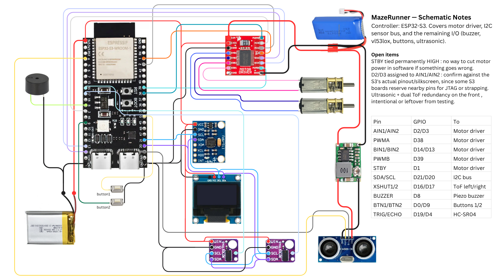

# MazeRunner

Autonomous maze-solving robot built with an ESP32-S3. Uses ultrasonic and ToF sensors to navigate, with an OLED display showing animated eyes that respond to tilt.

Work in progress.

## Schematic



## Hardware

- ESP32-S3-DevKitC-1 (8 MB flash)
- SSD1306 128x64 OLED (I2C)
- MPU6050 accelerometer/gyro (I2C)
- 2x VL53L0X time-of-flight sensors (left/right walls)
- HC-SR04 ultrasonic sensor (front)
- TB6612 motor driver + 2x DC gear motors
- WS2812 NeoPixel LED
- Piezo buzzer, 2x tactile buttons

## Wiring

| Signal | GPIO | Connects to |
|--------|------|-------------|
| AIN1 / AIN2 | 2 / 3 | Motor driver (motor A direction) |
| PWMA | 38 | Motor driver (motor A speed) |
| BIN1 / BIN2 | 14 / 13 | Motor driver (motor B direction) |
| PWMB | 39 | Motor driver (motor B speed) |
| STBY | 1 | Motor driver enable |
| SDA / SCL | 21 / 20 | I2C bus — shared by OLED, MPU6050, both VL53L0X |
| XSHUT 1 / 2 | 16 / 17 | VL53L0X address select |
| TRIG / ECHO | 19 / 4 | HC-SR04 ultrasonic |
| BUZZER | 8 | Piezo buzzer (PWM) |
| BTN1 / BTN2 | 0 / 9 | Menu buttons (pulled up internally) |
| NEOPIXEL | 48 | WS2812 data in |

The two VL53L0X sensors share the I2C bus. At startup, the firmware powers them on one at a time via the XSHUT pins and assigns them separate addresses (0x30 and 0x31).

ESP32 is powered from USB. Motors run off a separate battery with a common ground.

## How it works

The firmware has a button-cycled menu with four modes:

1. **Welcome** — shows the robot name and menu
2. **Greeting** — displays a message on the OLED
3. **Eyes** — animated eyes that track tilt via the MPU6050
4. **Autonomous Drive** — maze navigation using all three distance sensors

In autonomous mode the logic is reactive: if the front is blocked, turn toward whichever side is open. If both sides are blocked, reverse. Otherwise go forward.

## Build and upload

Requires [PlatformIO](https://platformio.org/).

```
pio run                  # compile
pio run -t upload        # flash to board
pio device monitor       # serial monitor at 115200
```

Libraries are pulled automatically by PlatformIO — no manual installs needed.

## Status

Working:
- Motor control, all sensor reads, OLED menu, eye animations, basic obstacle avoidance

Needs work:
- Non-blocking turn timing (currently uses delays)
- Wall-following algorithm
- Wi-Fi / remote control

## License

MIT
