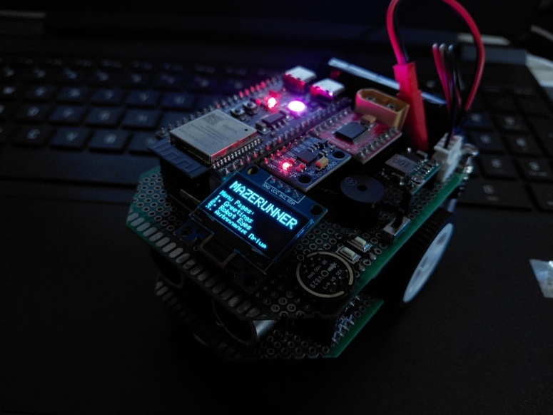
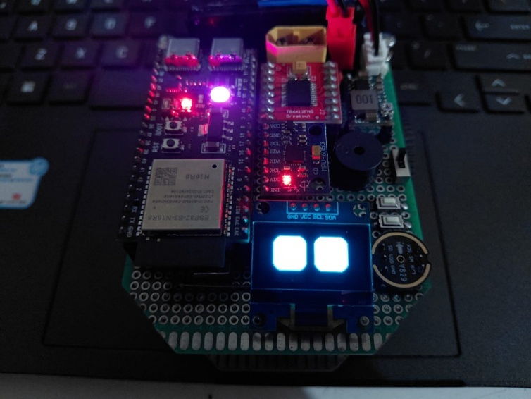
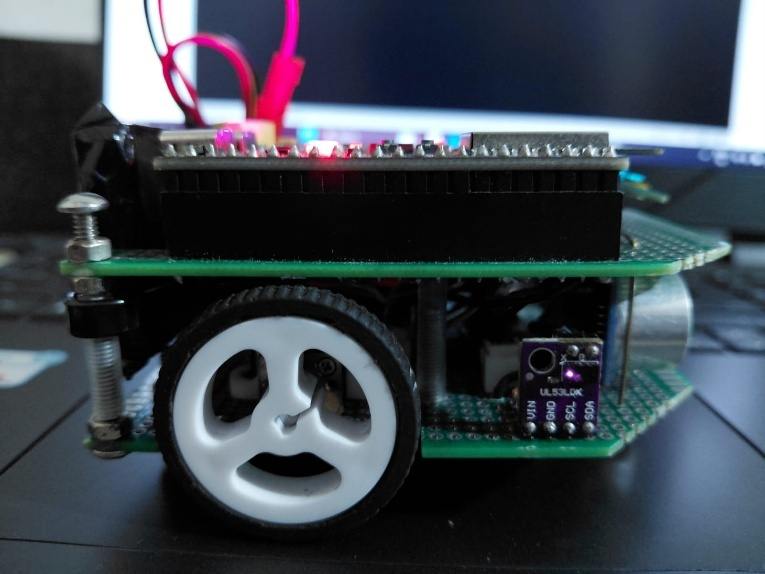
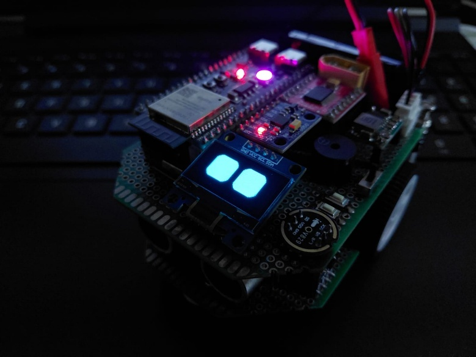
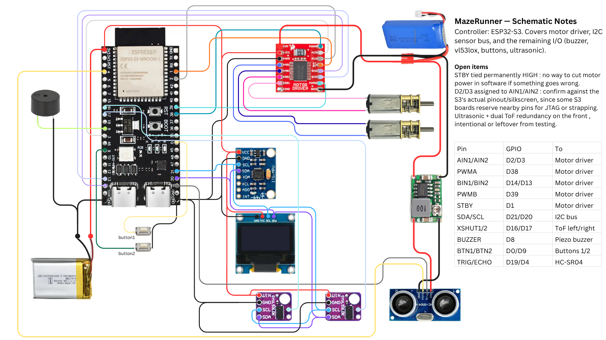

# MazeRunner

Autonomous maze-solving robot built with an ESP32-S3. Uses ultrasonic and ToF sensors to navigate, with an OLED display showing animated eyes that respond to tilt.

Work in progress.



## Gallery

| Front (LED Eyes) | Side (ToF Sensor) | Perspective |
|:---:|:---:|:---:|
|  |  |  |

## Schematic



## Hardware

- ESP32-S3-DevKitC-1 (8 MB flash)
- SSD1306 128x64 OLED (I2C)
- MPU6050 accelerometer/gyro (I2C)
- 2x VL53L0X time-of-flight sensors (left/right walls)
- HC-SR04 ultrasonic sensor (front)
- TB6612 motor driver + 2x DC gear motors
- WS2812 NeoPixel LED
- Piezo buzzer, 2x tactile buttons

## Wiring

| Signal | GPIO | Connects to |
|--------|------|-------------|
| AIN1 / AIN2 | 2 / 3 | Motor driver (motor A direction) |
| PWMA | 38 | Motor driver (motor A speed) |
| BIN1 / BIN2 | 14 / 13 | Motor driver (motor B direction) |
| PWMB | 39 | Motor driver (motor B speed) |
| STBY | 1 | Motor driver enable |
| SDA / SCL | 21 / 20 | I2C bus — shared by OLED, MPU6050, both VL53L0X |
| XSHUT 1 / 2 | 16 / 17 | VL53L0X address select |
| TRIG / ECHO | 19 / 4 | HC-SR04 ultrasonic |
| BUZZER | 8 | Piezo buzzer (PWM) |
| BTN1 / BTN2 | 0 / 9 | Menu buttons (pulled up internally) |
| NEOPIXEL | 48 | WS2812 data in |

The two VL53L0X sensors share the I2C bus. At startup, the firmware powers them on one at a time via the XSHUT pins and assigns them separate addresses (0x30 and 0x31).

ESP32 is powered from USB. Motors run off a separate battery with a common ground.

## How it works

The firmware has a button-cycled menu:

1. **Welcome** — shows the robot name and menu
2. **Greeting** — displays a message on the OLED
3. **Eyes** — animated eyes that track tilt via the MPU6050
4. **Autonomous Drive** — maze navigation using all three distance sensors
5. **Pose** — dead-reckoned position and heading
6. **Neural** — a small network drives the wheels on its own
7. **Laptop** — the robot asks the PC for a driving decision
8. **Voice** — hold BTN2, speak, get an answer

In autonomous mode the logic is reactive: if the front is blocked, turn toward whichever side is open. If both sides are blocked, reverse. Otherwise go forward.

### Neural drive

The neural page runs a tiny MLP (8 → 32 → 24 → 2) on the ESP32. Inputs are the three distances, the left/right distance deltas, the gyro rate and its previous output; the two outputs are wheel speeds. It was trained offline by imitating a hand-written wall follower:

```
python ml/train_policy.py
```

That regenerates `include/nn_policy.h` with int8 weights. Inference in `src/nn_policy.cpp` uses floats. A hard stop kicks in below 70 mm on the front sensor, no matter what the network says.

The training set is mirrored sample by sample, so the net can't learn a left/right bias from sampling noise. The teacher also spins in place when the front is blocked and both side sensors read the same, instead of creeping into the wall.

### Simulator and RL

`ml/sim.py` is a small differential-drive simulator with the same 8 inputs and the same 25 Hz command smoothing as the firmware. It has two maze styles (`rooms`, `s_curve`) and adds sensor noise, motor mismatch and ray-cast wall collisions:

```
python ml/sim.py --episodes 3 --render
python ml/sim.py --kind s_curve --seed 0
python ml/test_sim.py
```

`ml/train_rl.py` optimises the same 8 → 32 → 24 → 2 net with CEM. It starts from the supervised header by default, so it is a fine-tune rather than a from-scratch run:

```
python ml/train_rl.py --generations 20
python ml/train_rl.py --init random --generations 100
python ml/train_rl.py --no-write
```

The RL trainer only overwrites `include/nn_policy.h` when the candidate beats the current supervised policy on held-out mazes. `--force` skips that check. Treat the result as a simulator result: the real robot still needs a run on the floor before it is trusted.

### Motor trim

The two gear motors never run at exactly the same speed, so a straight command slowly drifts. While the robot is driving straight, the firmware averages the gyro yaw rate over a second and nudges a scale factor on the **left** wheel (motor B) until the heading stops drifting. Motor A is the physical right wheel and motor B is the left one. The value is saved in NVS and shown on the Pose page.

The web page can reset it or set it by hand in 2% steps, and the serial console accepts `!T109` for 1.09. The old five-burst calibration is still available at `/trim?cal=1`, but it needs 1.2 m of clear floor.

### Wireless control and OTA

The robot always starts a fallback access point:

- SSID: `MazeRunner`
- Password: `mazerunner123`
- Page: `http://192.168.4.1`

It also joins the WiFi stored in NVS (or `include/wifi_config.h` on a fresh board) and retries in the background every 20 s. Open the page from a phone or laptop to drive with the on-screen buttons, start/stop autonomous mode, set the trim, and watch the live distance and heading values. The WiFi form on the page saves a new SSID/password to NVS, so no USB is needed to switch networks.

The page also exposes every sensor separately for bench checks: front echo in microseconds and OK/OUT, left/right ToF in millimetres with timeout flags, IMU accel and gyro axes, yaw rate, gyro bias, wheel PWM, drive state, uptime and WiFi status. The **independent wheel tests** run one motor at a time for 0.9 s (left forward/reverse, right forward/reverse, both), and the OLED names the active test. `RETRY WIFI` and `REBOOT` are on the same page, so once this firmware is installed the robot does not need a USB cable for tuning.

Raw JSON is at `http://<robot-ip>/sensors`; wheel tests are `GET /test?wheel=1..4` or `/test?both=f|b`.

If the phone hotspot is hidden, the ESP32 scan cannot see its SSID. Unhide it in the phone's hotspot settings, or type the exact SSID/password into the WiFi form. The robot keeps the fallback AP up and retries every 20 s.

Once this firmware is installed, future flashes can go over WiFi:

```
pio run -e ota -t upload
pio run -e ota -t upload --upload-port 192.168.4.1   # fallback AP
```

OTA uses the hostname `mazerunner.local` and the password `mazerunner`.

### Laptop bridge

`server.py` runs on a laptop on the same Wi-Fi and wraps ollama (`qwen2.5:3b` by default) and vosk:

```
python server.py
```

Set the laptop's IP on the robot's web page (or define `LAPTOP_HOST` in `include/wifi_config.h`). The robot then posts to `/drive` every 2 s for a movement decision, and the voice page uploads a wav to `/stt` instead of using USB serial. `/ask` answers typed questions from the web page, `/health` tells you if the bridge is alive.

## Build and upload

Requires [PlatformIO](https://platformio.org/).

```
pio run                  # compile
pio run -t upload        # flash to board over USB
pio device monitor       # serial monitor at 115200
```

The laptop bridge needs `flask`, `vosk` and a local [ollama](https://ollama.com/) with `qwen2.5:3b` pulled.

Libraries are pulled automatically by PlatformIO — no manual installs needed.

## Status

Working:
- Motor control, all sensor reads, OLED menu, eye animations, basic obstacle avoidance
- Neural wall follower and pose dead reckoning
- Wi-Fi web control, voice page, laptop LLM bridge
- Simulator and CEM training for the neural policy

Needs work:
- Real-maze validation of the motor-side fix and learned trim
- Wheel balance/traction: the chassis veers without trim; tune on open floor
- Better neural training data (the teacher is still pretty simple)
- Cleaner laptop page (one decision every 2 s is slow)

## License

MIT
